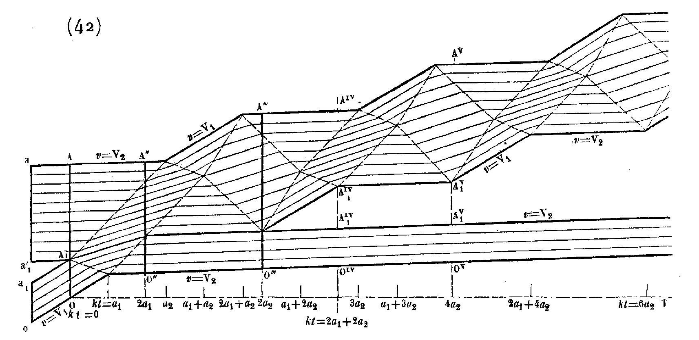

.. DO NOT EDIT.
.. THIS FILE WAS AUTOMATICALLY GENERATED BY SPHINX-GALLERY.
.. TO MAKE CHANGES, EDIT THE SOURCE PYTHON FILE:
.. "auto_examples/plot_3_deSaintVenant.py"
.. LINE NUMBERS ARE GIVEN BELOW.

.. only:: html

    .. note::
        :class: sphx-glr-download-link-note

        Click :ref:`here <sphx_glr_download_auto_examples_plot_3_deSaintVenant.py>`
        to download the full example code

.. rst-class:: sphx-glr-example-title

.. _sphx_glr_auto_examples_plot_3_deSaintVenant.py:

De Saint Venant displacement diagrams
=====================================

Define a :class:`BarSet` bar configuration and use it with :class:`WP2` reproduce
the displacement diagrams of de Saint Venant in:

* de Saint-Venant, A. J. C. B. (1867). Mémoire sur le choc longitudinal de deux 
  barres élastiques de grosseurs et de matières semblables ou différentes, 
  et sur la proportion de leur force vive qui est perdue pour la translation ultérieure; 
  et généralement sur le mouvement longitudinal d’un système de deux ou plusieurs 
  prismes élastiques. *Journal de mathématiques pures et appliquées 2e série*, 12, 237‑376. 
  https://gallica.bnf.fr/ark:/12148/bpt6k16411c

.. GENERATED FROM PYTHON SOURCE LINES 17-24

.. code-block:: default

    # sphinx_gallery_thumbnail_number = 4
    import numpy as np
    from elwaspatid import WP2, BarSet
    import matplotlib.pyplot as plt

.. GENERATED FROM PYTHON SOURCE LINES 25-26

Define a few parameters

.. GENERATED FROM PYTHON SOURCE LINES 26-32

.. code-block:: default

    E = 201e9  # Young modulus [Pa]
    rho = 7800  # Density [kg/m3]
    d = 0.020  # diameter [m]
    k = 2.4  # diamters ratio [-]

.. GENERATED FROM PYTHON SOURCE LINES 33-34

Create the bar configuration

.. GENERATED FROM PYTHON SOURCE LINES 34-39

.. code-block:: default

    bc4 = BarSet([E, E], [rho, rho], [.4, 1.], [d, d], nmin=10)

    test2v = WP2(bc4, nstep=160, left='free', right='free', Vinit=10)
    test2v.plot('2b_veloc')

.. rst-class:: sphx-glr-horizontal

    *

      .. image-sg:: /auto_examples/images/sphx_glr_plot_3_deSaintVenant_001.png
         :alt: Force [N]
         :srcset: /auto_examples/images/sphx_glr_plot_3_deSaintVenant_001.png
         :class: sphx-glr-multi-img

    *

      .. image-sg:: /auto_examples/images/sphx_glr_plot_3_deSaintVenant_002.png
         :alt: Velocity [m/s]
         :srcset: /auto_examples/images/sphx_glr_plot_3_deSaintVenant_002.png
         :class: sphx-glr-multi-img

    *

      .. image-sg:: /auto_examples/images/sphx_glr_plot_3_deSaintVenant_003.png
         :alt: Displacement [m]
         :srcset: /auto_examples/images/sphx_glr_plot_3_deSaintVenant_003.png
         :class: sphx-glr-multi-img

.. rst-class:: sphx-glr-script-out

 Out:

 .. code-block:: none

    Setting initial velocity of first segment (Vo=10)

.. GENERATED FROM PYTHON SOURCE LINES 40-43

Plot de Saint Venant displacement diagram and compare it with the orignal one.
The only difference is that the second bar is at rest, whereas in de Saint Venant
it has a velocity smaller than the initial velocity of the impactor.

.. GENERATED FROM PYTHON SOURCE LINES 43-45

.. code-block:: default

    test2v.plotDeSaintVenant(figname='deStV')
    plt.figure('deStV').set_figwidth(10)

.. image-sg:: /auto_examples/images/sphx_glr_plot_3_deSaintVenant_004.png
   :alt: displacement scale factor 100
   :srcset: /auto_examples/images/sphx_glr_plot_3_deSaintVenant_004.png
   :class: sphx-glr-single-img

.. GENERATED FROM PYTHON SOURCE LINES 46-49

   Diagram 42, page 277, de Saint Venant

.. rst-class:: sphx-glr-timing

   **Total running time of the script:** ( 0 minutes  1.898 seconds)

.. _sphx_glr_download_auto_examples_plot_3_deSaintVenant.py:

.. only :: html

 .. container:: sphx-glr-footer
    :class: sphx-glr-footer-example

  .. container:: sphx-glr-download sphx-glr-download-python

     :download:`Download Python source code: plot_3_deSaintVenant.py <plot_3_deSaintVenant.py>`

  .. container:: sphx-glr-download sphx-glr-download-jupyter

     :download:`Download Jupyter notebook: plot_3_deSaintVenant.ipynb <plot_3_deSaintVenant.ipynb>`

.. only:: html

 .. rst-class:: sphx-glr-signature

    `Gallery generated by Sphinx-Gallery <https://sphinx-gallery.github.io>`_
